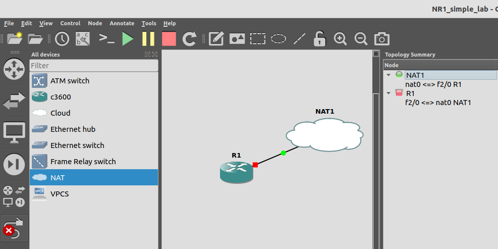

In a [previous lab](#) we showed how to use New Relic to monitor a single network device; and then how to monitor multiple devices. But in real life, you might not have a pile of network gear lying around. Or, alternately, you might want to explore monitoring a more complex network than the lab you DO have. The challenge is how to get a bigger network without burning a pile of both cash and time? And the solution is a free utility called GNS3.

In this lab, we’ll show how to build a virtual network in GNS3 and then monitor it all with New Relic.
Getting started
This lab is designed to be run on a single system - it can be a physical machine or a VM, with the specifications shown below. For this lab, you’ll need the following: 
 * a machine running Ubuntu 21.04 desktop (not server)
    - >=8Gb RAM
    - >=4 CPU running >=1.8Ghz
    - >=100Gb Disk space
 * the Cisco IOS image for a 3600 router
 * an account on https://one.newrelic.com 
 * an account on https://www.gns3.com 

##Step 1: Install the software packages

Because we’re running a Linux system, everything can be installed from the command line. Along with GNS3, we’ll be installing OpenSSH and Docker.

###Install Open SSH

We’ll start by installing OpenSSH so we can remotely connect to this machine and copy-paste commands later. 

Open a terminal window and type the following commands. Note that you'll be prompted for your password after the first `sudo` statement.

    sudo apt-get install openssh-server
    sudo systemctl enable ssh
    sudo systemctl start ssh

###Install SNAP and Docker

Now we’ll install the SNAP package manager, and use it to install docker

    sudo apt install snapd
    sudo snap install docker

###Update Docker permissions

The New Relic agent will need to interact with Docker. To allow this, we have to give Docker permissions to the account you plan to use to install the New Relic agent. This lab assumes you will install everything - Docker, New Relic, GNS3, etc - all using the same account.

    sudo groupadd docker 
    sudo usermod -aG docker $USER
    newgrp docker

###Install GNS3

Finally, we’ll install GNS3:

    sudo add-apt-repository ppa:gns3/ppa
    sudo apt update                                
    sudo apt install gns3-gui gns3-server
    sudo dpkg --add-architecture i386
    sudo apt update
    sudo apt install gns3-iou

##Set up GNS3

You can start GNS3 either running the command `gns3` in a terminal window, or by finding it's icon in the application panel.

On the first startup, you will be prompted about the location of the GNS3 server. 

Create a new project, and name it "NR_and_GNS3"

Next we need to add router images to the system so that we can use them in our GNS3 network. 
 * make sure the Cisco IOS image for a 3600 router is on the machine running GNS3
 * go to Edit, Preferences
 * Click "IOS Routers" from the sidebar, and click "New"

 * Choose “run this IOS router on my local computer”

 * Select “New Image” and browse for the image on your system

 * Give the router a name (it can be anything), select the platform, and chassis type. NOTE: not all devices have a chassis option
 * On the following screen, confirm RAM
 * Select what goes in each “slot.” This is where you specify the type of network interfaces your virtual router will have—Ethernet, fast Ethernet, gig Ethernet, T1, serial, etc.

 * For the purpose of New Relic, you MUST make sure you have at least one Ethernet type (regular, fast, or gig) port
 * You’ll also want to have GNS3 validate the Idle-PC setting 
 * Click apply, save, etc. until you’re back at the main screen

This should take you back at the main GNS3 screen.

#Build the network in GNS3

 * Start by adding a router to the design space

 * Add a NAT cloud, making sure to indicate it’s running on the local server.

Now we’re going with a VERY simple setup—a single router directly connected to the cloud. You can check out (!!MEHREEN - WE SHOULD DECIDE WHETHER TO POINT TO A BLOG OR THE EBOOK HERE!!) for instructions on how to set up a 3-router environment. 

 * Connect the Ethernet port of the router to the nat0 port of the cloud

 * Start the router either by clicking the “play” button on the toolbar, or by right-clicking the router and choosing “Start”

#Configure the router

 * Right-click the router and choose “console”
 * Hit enter a couple times to get to an “R1” prompt
 * Get into configuration mode by typing “conf t”
 * The following set of commands will set up the minimum elements needed for the New Relic agent to monitor the router.

   conf t
   snmp-server community nr1gns3 ro
   int fa2/0
   ip addr dhcp
   no shut
   end
   wr mem

NOTE: 
 * The SNMP read-only string is “nr1gns3”
 * The FastEthernet interface is configured to use DHCP

Make sure you see a DHCP message indicating the interface has been assigned an IP address. It will look like this:

Make a note of this IP, since you’ll want to use it for both testing and troubleshooting, and more importantly for the actual monitoring we’ll do later.

At this point, you have a “network” ready for monitoring by New Relic. It’s not particularly awe-inspiring, but it’ll get the job done and proves the concept.

(!!!MEHREEN - should we re-use the other lab, or point them to that lab instead?!!)
